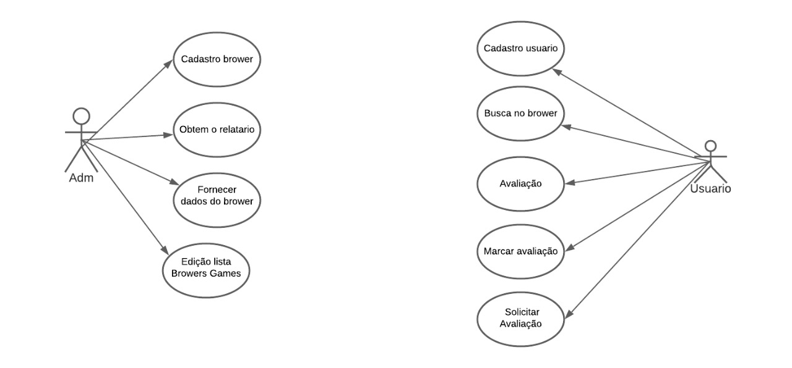
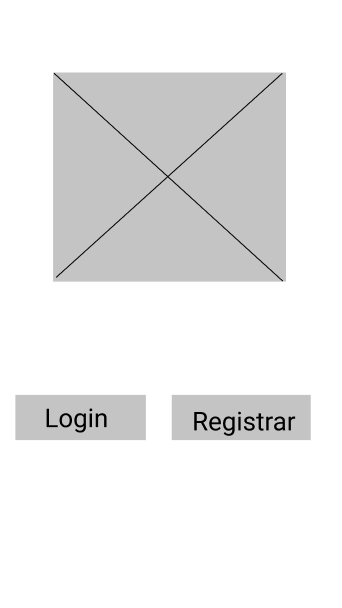
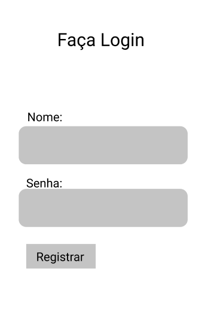
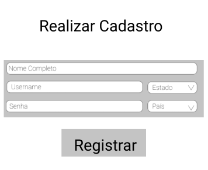

# GBG (Good Browser Games)

###   Nomes dos Integrantes
Leonardo Calisto de Faria Simões – 32089716 
Yann Santos Rocha – 32054246 
Thiago José Barella – 32082118 
Guilherme Hiroshi Saito Canal – 32071019 

***

### índice
* 1 . Introdução
* 2 . Escopo do projeto
* 3 . Interessados
* 4 . Objetivos funcionais
* 5 . Objetivos não-funcionais
* 6 . Casos de uso
* 7 . Descrição dos casos de uso principais
* 8 . Protótipos de Tela
* 9 . Modelo de domínio
* 10 . Lista de decisões de arquitetura
* 11 . Diagrama de classes de Projeto
* 12 . Diagramas de sequência de Projeto1. 

# 1. Introdução
Neste arquivo será apresentado e documentado o projeto de desenvolvimento do **GoodBrowserGames**, uma plataforma online que reúne jogadores e interessados para uma rede de avaliação e interação de Browser Games. Nesta documentação serão apresentados os itens descritos no índice.

# 2. Escopo do Projeto
O escopo deste projeto é um sistema web que permite com que membros descubram e avaliem browser games, com o intuito de criar um ambiente simples onde qualquer um possa encontrar os jogos que gosta.

# 3. Interessados
Os Interessados do GoodBrowserGames serão todos aqueles que já jogam, ou tem interesse de começar a jogar, os chamados Browser Games, que são aqueles jogos que pode ser utilizado a partir do navegador, sem a necessidade de instalação. Pessoas que querem tornar publicas suas opiniões sobre os jogos, e aqueles que desejam apenas desfrutar de opiniões alheias, para assim, escolher um bom jogo, ou um que se encaixe com seu perfil, são os principais “alvos” da plataforma. 

# 4. Objetos Funcionais
* Cadastro de Browser Games.
* Incluir/Excluir/Alterar categorias de jogos.
* Preenchimento de informações sobre o jogo cadastrado.
* Cadastro de usuário, através do preenchimento de dados.
* Atualização de dados fornecidos pelo cliente no cadastro.
* Busca de games pelo nome, ou parte dele.
* Busca do game pela categoria.
* Avaliação do game em uma avaliação de 1 a 5.
* Caixa de texto para avaliação escrita de até 255 caracteres.
* Visualização de demais avaliações.
* Opção selecionável de categorizar uma avaliação alheia como “Útil para mim.”.
* Solicitação das avaliações mais úteis da comunidade.
* Recomendação de browser games personalizadas para cada usuário. 

# 5. Objetos Não Funcionais
* Módulo de informações cadastrais deverá ser online.
* Linguagem específica: JavaScript, HTML 5, CSS 3
* Executável nos navegadores Google Chrome e Mozilla Firefox
* O sistema deverá se comunicar com o banco SQL Server.
* O sistema não apresentará aos usuários quaisquer dados de cunho privativo.
* Usuários deverão operar o sistema após um castro.
* O sistema deverá ter alta disponibilidade.
* O algoritmo do sistema deverá entender qual recomendação de Browser Games mais se enquadra com o usuário. 

# 6. Casos de Uso

;

# 7. Descrição dos casos de uso principais
### 7.1. Cadastro usuário (CDU002)

Resumo: Uma pessoa que acessa a página inicial da Good Browser Games tem a opção de tornar-se um membro. Tornando-se um membro, ele poderá avaliar e obter recomendações de browser games.
Ator principal: Usuário
Pré-condições: Nenhuma
Pós-condições: O visitante está registrado como membro e consegue acessar as funções restritas aos membros da Good Browser Games.

### Fluxo principal
* A pessoa seleciona a opção de tornar-se um membro.
* O sistema solicita os dados iniciais para o registro: nome completo, username, senha, data de nascimento, estado e país.
* A pessoa fornece os dados solicitados.
* O sistema verifica se o username informado está disponível.
* O sistema verifica se a senha do visitante atende os critérios estabelecidos
* O sistema registra a pessoa como membro.
* O sistema informa a pessoa de que ele está registrado e pode acessar o sistema.

### Fluxos de exceção

**Passo 4 (username não está disponível):**

O sistema verifica que o username escolhido já está sendo utilizado e solicita que o visitante escolha outro. O caso de uso retorna para o passo 2 do fluxo principal.

## 7.2. Avaliação (CDU002)
**Resumo:** O membro irá realizar a avaliação de um browser game que ele já jogou.
**Ator principal:** Membro
**Pré-condições:** O usuário é um membro registrado da GBG e já havia pesquisado um determinado Browser Game
**Pós-condições:** A avaliação é registrada no sistema.

### 7.3. Buscar Browser Games (CDU003)

**Resumo:** O membro irá realizar a busca de um browser game
** Ator principal:**  Membro
** Pré-condições:**  O usuário é um membro registrado da GBG
** Pós-condições:**  Um browser game será devolvido ao membro.

**Fluxo principal**
* O membro seleciona a opção de buscar um browser game.
* O sistema fornece ao membro as opções para buscar um game.
* O membro seleciona a opção de busca pelo nome.
* O sistema solicita o nome do game que o membro deseja buscar.
* O membro fornece o nome do game.
* O sistema devolve ao membro o browser game na qual ele estava buscando.

**Fluxo alternativo 1**
* O membro seleciona a opção de busca pela categoria.
* O sistema fornece ao membro uma lista das categorias cadastradas.
* O membro seleciona uma das categorias.
* O sistema apresenta uma lista do browser games da categoria escolhida em ordem alfabética.

**Fluxos de exceção**
**Passo 6 (nome inválido):**
O sistema verifica que não existe um browser game com aquele determinado nome e informa ao membro. O caso de uso retorna para o passo 3 do fluxo principal.

## 7.4. Cadastrar Browser Games (CDU004)
**Resumo:** O administrador cadastra um novo browser game no sistema.
**Ator principal:** Administrador
**Pré-condições:** Nenhuma
**Pós-condições:** Um novo Browser é adicionado ao sistema.

**Fluxo principal**
* O administrador seleciona a opção de cadastrar um browser gane.
* O sistema carrega a tela de cadastro de browser game.
* O administrador fornece ao sistema o nome, categoria, URL de acesso ao jogo, URL do vídeo de demonstração, descrição e imagem ilustrativa.
* O sistema valida as informações e cadastra o novo browser game.
* O sistema informa que o game foi cadatrado com sucesso.
* O sistema retornar ao menu de administrador.
* 
**Fluxos de exceção**
**Passo 4 (informações inválidas):**
* O caso de uso retorna para o passo 3 do fluxo principal.

## 7.5. Atualizar Cadastro (CDU005)
**Resumo:** Um membro clica no menu do site e escolhe a opção de atualizar cadastro.
**Ator principal:** Membro
**Pré-condições:** Nenhuma
**Pós-condições:** O Membro tem seu cadastro atualizado.
**Fluxo principal**

* O membro seleciona a opção de atualizar cadastro no menu do site.
* O sistema carrega a tela de atualização de cadastro.
* O membro fornece os novos dados que serão utilizados e pressiona o botão atualizar.
* O sistema verifica se os novos dados inseridos são válidos.
* O sistema atualiza os dados do membro em questão
**Fluxos de exceção**
**Passo 4 (informações inválidas):**
* O caso de uso retorna para o passo 3 do fluxo principal.

# 8. Protótipos de Tela
## Home
; 
## Login/Cadastro
;
; 
;

# 11. Diagrama de classes do projeto

